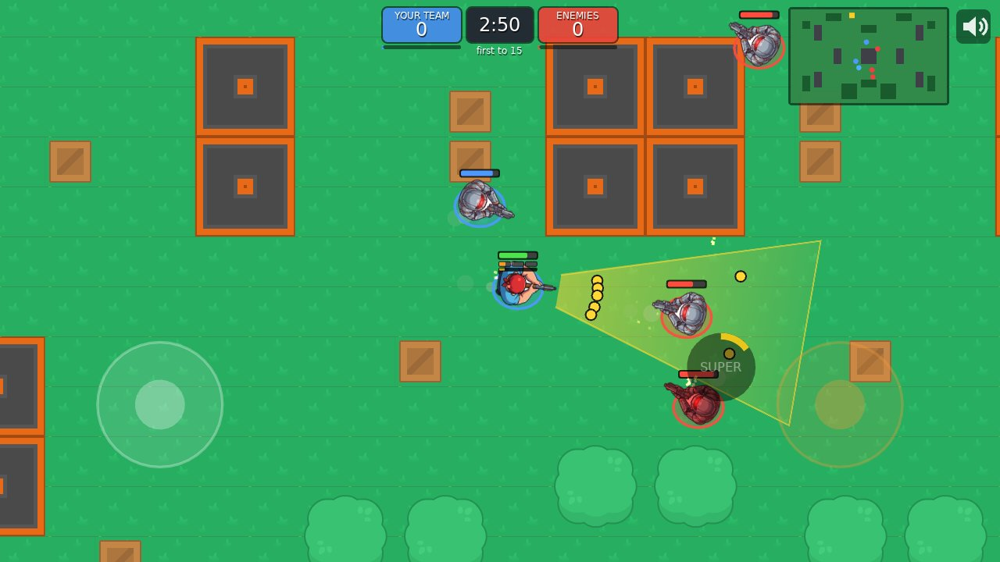

# Yard Wars

A fast top-down arena shooter for Android and desktop, made with [LÖVE](https://love2d.org/).
Pick a rowdy, fight bots or friends in your Wi-Fi, smash treasure chests for coins and
unlock new rowdies.



**Play it:** download and installation instructions are on the website,
<http://yardwars.zeromips.org/>. Installed copies update themselves.

## Features

- Four rowdies, each with its own attack and a super attack: Shotgunner, Gunner, Sniper
  and Robot
- Modes: Duel, Team fight (3 vs 3) and Waves, against bots
- Play together in the same Wi-Fi: free-for-all, team fight and co-op waves, the host is
  found automatically
- Touch controls (move stick, aim and release to fire) and keyboard + mouse
- New rowdies: save up coins (treasure chests, round rewards) and beat the rowdy in a
  boss fight - you can't lose, you pop back in until it's out (alone or with friends)
- Signed automatic updates

## Running from source

Install [LÖVE 11.5](https://love2d.org/), then in this folder:

```
love .
```

A checkout like this never updates itself; only packaged builds do.

Useful options for testing: `--rowdy N` (start with rowdy N), `--coins N` (add coins),
`--boss N [host]` (boss fight against rowdy N),
`--host [team|waves]` and `--join <address>` / `--find` (LAN game on one machine: run
two instances). Playing over the network uses UDP ports 27015 and 27016.

## Project layout

- `main.lua` - screens, game loop, camera, HUD
- `src/world.lua` - the game simulation (no graphics, also runs on the LAN host)
- `src/rowdies.lua` - the rowdies' stats and supers
- `src/net.lua`, `src/replica.lua` - LAN multiplayer
- `src/updater.lua`, `src/rsa.lua` - signed self-updates over http
- `tools/` - packaging (`build.sh`), publishing (`publish.sh`, needs the signing key) and
  the sprite cutter for the character art
- `website/` - the static website

`CLAUDE.md` has the detailed developer notes.

## Credits

Yard Wars is a father-and-son project by Gideon and Dirk Eibach. Code written with the
help of an AI assistant (Claude); character art generated with Google Gemini. Arena tiles
from the [Top-down Shooter pack](https://kenney.nl/assets/top-down-shooter) by Kenney
(CC0). See [CREDITS.md](CREDITS.md).

## License

MIT, see [LICENSE](LICENSE).
